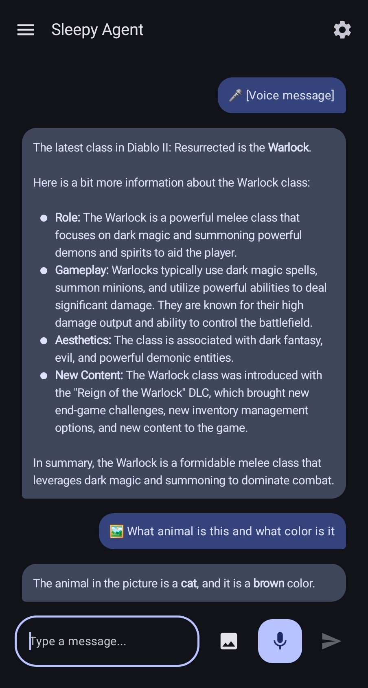

# Sleepy Agent

A fully local AI assistant for Android powered by Google's Gemma 4 models via LiteRT-LM. Your conversations stay on your device - no cloud required. Can search the web when you need up-to-date information.

<p align="center">
  
</p>

## Features

### 🔒 Fully Local Inference
- **Voice, image, and text processing** all happens on-device
- No internet connection required for inference (except for web search tool)
- Conversations stay private - no data sent to external AI services

### 🎙️ Voice Input
- Tap the mic button and speak naturally
- Voice Activity Detection (VAD) automatically stops recording after you finish speaking
- Optional TTS (Text-to-Speech) responses when using voice input

### 🖼️ Image Understanding
- Send images from your gallery or take a photo
- Ask questions about what's in the image
- Works with text prompts alongside images

### 📝 Text Chat
- Full markdown support including tables and code blocks
- Persistent conversation history
- Navigate between multiple chat sessions

### 🧠 Gemma 4 via LiteRT-LM
- Powered by Google's official LiteRT-LM SDK
- Choose between **E2B** (2B params, ~2.7GB, faster) or **E4B** (4B params, ~4.5GB, higher quality)
- 16K token context window
- KV cache reuse for faster multi-turn conversations
- **Performance**: E2B runs at ~25-30 tokens/sec on a Samsung Galaxy Z Fold 5 (personal testing)

### 📥 Easy Model Setup
- **Download directly in the app**: Settings → Download Gemma 4 E2B/E4B
- **Or select your own model**: Use any `.litertlm` file from HuggingFace LiteRT Community
- Device info card shows your RAM to help choose the right model

### 💾 Session Management
- Navigation drawer shows all your past conversations
- Continue previous chats or start fresh
- Auto-saved conversation history

### 🔊 Smart TTS
- Optional text-to-speech for responses
- Auto-detect mode: speaks when you use voice input, silent for text input

## Work in Progress

- **Floating Bubble**: Quick access overlay (requires additional permissions)
- **Home Server Delegation**: Optionally route requests to your own server

## Requirements

- Android 8.0+ (API 26)
- 4GB+ RAM recommended
- ~3GB free storage for E2B model (~5GB for E4B)

## Building

See [DEVELOPMENT.md](docs/DEVELOPMENT.md) for detailed build instructions.

Quick build:
```bash
./gradlew :app:assembleDebug
```

The debug APK is ~50MB (arm64-v8a only).  

## Web Search Setup

The app can search the web using a SearXNG server. To set up your own, see [DEVELOPMENT.md](docs/DEVELOPMENT.md).

## Model Sources

Download `.litertlm` models from:
- [HuggingFace LiteRT Community](https://huggingface.co/litert-community)
- Gemma 4 E2B: `gemma-4-E2B-it-litert-lm`
- Gemma 4 E4B: `gemma-4-E4B-it-litert-lm`

## License

MIT License - See LICENSE file
